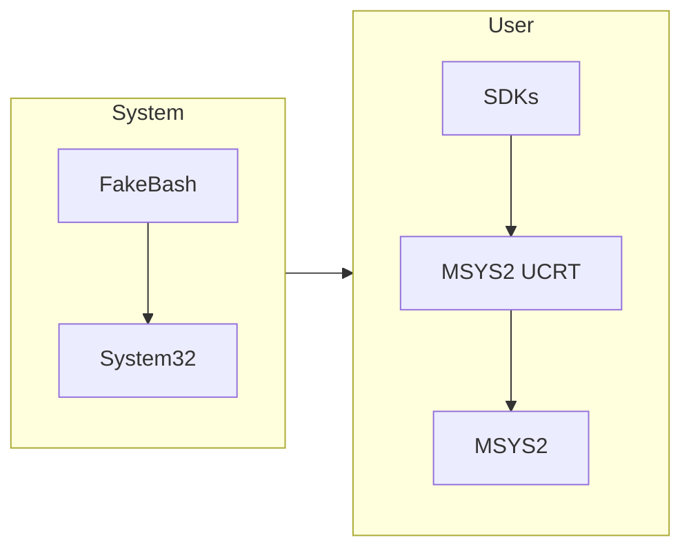

# MSYS2

## Mirror

```sh
sed -i "s#https\?://mirror.msys2.org/#https://mirror.nju.edu.cn/msys2/#g" /etc/pacman.d/mirrorlist*
```

Refer [Mirrors](../Mirrors.md).

## Promote MSYS2

### Override `curl` & WSL `bash`

WSL 默认会写入 `bash` 到 `/c/Users/Kevin/AppData/Local/Microsoft/WindowsApps/bash` 以及 `/c/Windows/system32/bash`, 导致无法直接添加环境变量。这里构建一个 FakeBash 用于伪造新目录 cover 掉 System32 的bash。

```bash
mkdir -p /c/Tools/FakeBash
```

管理员启动 CMD

```cmd
mklink C:\Tools\FakeBash\bash.exe C:\msys64\usr\bin\bash.exe
mklink C:\Tools\FakeBash\curl.exe C:\msys64\usr\bin\curl.exe
```

修改系统环境变量 `System->PATH`，将

```text
C:\Tools\FakeBash
```

添加到 `%SystemRoot%\system32` 之前。

### Make MSYS2 Replace Pwsh

修改用户环境变量 `User->PATH`，将

```sh
C:\msys64\ucrt64\bin
C:\msys64\usr\bin
```

添加到 SDK 环境下方。

> MSYS2 本身可能安装了 python, node etc.
> 事实上大家还是会使用 Windows 标准环境的 SDKs，因此不要把 MSYS2 覆盖本身的 SDK 路径。



## `sudo`

Install `gsudo`: <https://github.com/gerardog/gsudo/releases/>

```sh
echo "alias sudo='gsudo'" >> ~/.bashrc
```

## Windows Terminal

```json
            {
                "commandline": "C:\\msys64\\usr\\bin\\zsh.exe",
                "guid": "{d6954913-da5a-45df-935a-b1b17627684d}",
                "hidden": false,
                "historySize": 9001,
                "name": "Zsh",
                "useAcrylic": true
            },
            {
                "commandline": "C:\\msys64\\usr\\bin\\bash.exe",
                "guid": "{0432633c-5956-4740-92c9-ce3099453409}",
                "hidden": false,
                "historySize": 9001,
                "name": "Bash",
                "useAcrylic": true
            },
```
